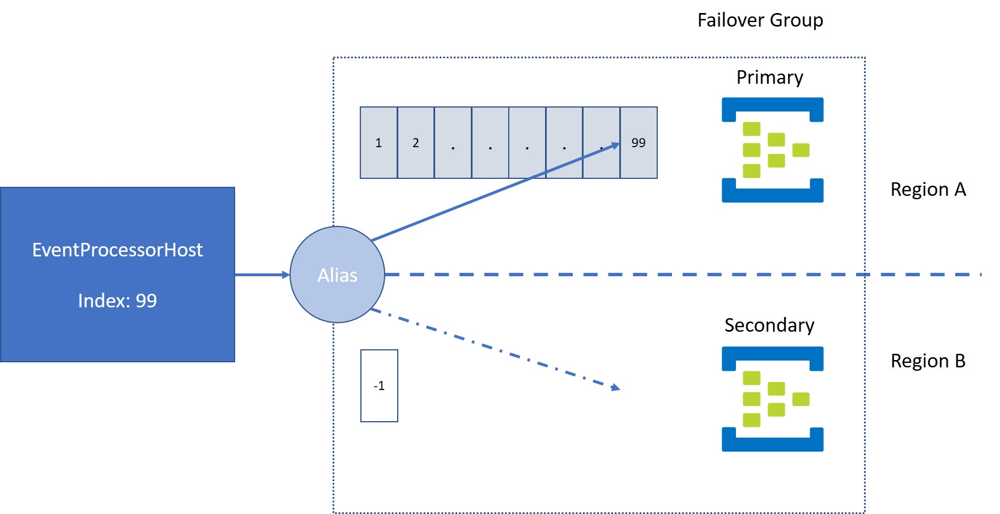

# Publisher / Consumer example for Geo-DR enabled eventhubs

When setting up a Geo-DR enabled eventhub and perform a failover, there are certain aspects that you need to be aware of:

1. The synchronization won't synchronize the data. You only get metadata synchronization
2. The consumer client, won't be able to continue seamlessly in case of a failover
* The indexes into the partitions, won't match in your consumer's EventHubProcessor once you switch over.
* Checkpointing can be tricky, as checkpoints are stored in a shared blob storage and won't mean anything in a failover event hub

The sample contains possible solutions for the consumer side of the eventhub clients. 

## Publisher
The publisher is transparently sending messages to the new eventhub in case of a failover, without any intervention. The only special consideration with the publisher is that you are using the connection string with the alias rather than the direct connection string. There is a short delay when you switch (~2s), but the SDK handles that without a problem.

## Consumer
### Partition indexes
When reading from patitions, EPH will keep the index information in memory. As long as the event hub you are reading from does not change, there is no problem with that. Once the event hub does failover, the stored in memory index will be pointing to a location that does not exist in the failover hub.

The consumer starts consuming events from the primary event hub region and reaches index 99 on partion 0. At that point a the primary hub fails and we trigger a failover to the secondary hub. The setup uses the alias and eventually, the connection is re-established to the secondary region. EPH is still using the same instance and the index it was using in the primary region will cause to try start reading from the same index: 99. Since there is no message replication, that index does not exist and the read will fail. 

To overcome this limitation, the EPH needs to be re-initialized when a failover error is detected. The sample consumer does that by analyzing the incoming errors and notifying the EPH manager about failures, causing it to re-initialize the instance.

### Checkpointing
A similar problem exists with checkpointing. Obviously the checkpoints created for a particular event hub, are not valid for a hub you are failing over to. The easiest fix for that is to have 2 dedicated containers, switching them at the same time you re-initialize the EPH to reset the indexes.

# Setup
## Azure
1. Create an event hub namespace in your subscription
2. Create an event hub in that namespace
3. Open the Geo-Recovery tab and click on "Initiate Pairing"
4. Select a location (possibly different from your primary region)
5. Select Create new and specify a name for the secondary region
6. Click Create
7. Create a storage account and a container for the checkpoints
8. If you want to try out checkpointing, add a 2nd container for your secondary hub

## Configuration
### Publisher
Fill in the following settings in appsettings.json
- EventHubConnectionString 
- EventHubName

## Consumer
Fill in the following settings in appsettings.json
- EventHubConnectionString 
- EventHubName
- StorageConnectionString
- StorageContainerPrimary
- StorageContainerSecondary

If you want to use checkpointing you need to fill in both, Primary and Secondary connection strings. Otherwise, just use the Primary connection string

Once you run the publisher and the subscriber you should see messages flowing through the primary event hub.

# Failover
1. Open the Geo-Recovery tab of your primary event hub
2. Click Failover

It will take a while to complete the failover operation. Publisher and Consumer should continue to publish and receive messages.
